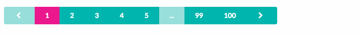

# semantic-ui-react-button-pagination

[](https://travis-ci.org/szmslab/semantic-ui-react-button-pagination)
[](https://coveralls.io/github/szmslab/semantic-ui-react-button-pagination?branch=master)
[](https://www.npmjs.com/package/semantic-ui-react-button-pagination)

A pagination component for [Semantic UI React](https://react.semantic-ui.com/) using Button.

## Installation

```bash
npm install semantic-ui-react-button-pagination
```
## Demo

[](https://szmslab.github.io/semantic-ui-react-button-pagination/)

#### [Demo](https://szmslab.github.io/semantic-ui-react-button-pagination/)

## Example

```html
<!DOCTYPE html>
<html lang="en">
<head>
  <meta charset="UTF-8">
  <title>Example of semantic-ui-react-button-pagination</title>
  <link rel="stylesheet" href="//cdnjs.cloudflare.com/ajax/libs/semantic-ui/2.3.3/semantic.min.css">
</head>
<body>
  <div id="app"></div>
  <script src="bundle.js"></script>
</body>
</html>
```

```javascript
import React from 'react';
import ReactDOM from 'react-dom';
import Pagination from 'semantic-ui-react-button-pagination';

class Example extends React.Component {
  constructor() {
    super();
    this.state = {offset: 0};
  }

  handleClick(offset) {
    this.setState({offset});
  }

  render() {
    return (
      <Pagination
        offset={this.state.offset}
        limit={10}
        total={100}
        onClick={(e, props, offset) => this.handleClick(offset)}
      />
    );
  }
}

ReactDOM.render(
  <Example/>,
  document.getElementById('app')
);
```

## Props

| Name | Default | Type | Description |
| -----| ------- | -----| ----------- |
| **`limit`** (required) |  | custom | The number of rows per page. Allow a number greater than or equal to `1`.|
| **`offset`** (required) |  | custom | The number of rows to skip. Allow a number greater than or equal to `0`.|
| **`total`** (required) |  | custom | The total number of rows. Allow a number greater than or equal to `0`.|
| `as` |  | custom | An element type of the group of buttons to render as (string or function). |
| `attached` |  | bool&#124;enum | The group of buttons can be attached to other content.<br><br>Enums:<br>`left` `right` `top` `bottom` |
| `basic` | false | bool | Basic buttons is less pronounced. |
| `className` |  | string | Additional classes of the group of buttons. |
| `color` |  | enum | Buttons can have different colors.<br><br>Enums:<br>`red` `orange` `yellow` `olive` `green` `teal` `blue` `violet` `purple` `pink` `brown` `grey` `black` |
| `compact` | false | bool | Buttons can reduce its padding to fit into tighter spaces. |
| `currentPageColor` |  | enum | The current page button can have different colors.<br><br>Enums:<br>Same as 'color'. |
| `currentPageNegative` | false | bool | The current page button can hint towards a negative consequence. |
| `currentPagePositive` | false | bool | The current page button can hint towards a positive consequence. |
| `currentPagePrimary` | false | bool | The current page button can be formatted to show different levels of emphasis. |
| `currentPageSecondary` | false | bool | The current page button can be formatted to show different levels of emphasis. |
| `currentPageStyle` |  | object | Apply the inline-styles to the current page button. |
| `disabled` | false | bool | Buttons can show it is currently unable to be interacted with. |
| `floated` |  | enum | The group of buttons can be aligned to the left or right of its container.<br><br>Enums:<br>`left` `right` |
| `fluid` | false | bool | The group of buttons can take the width of their container. |
| `inverted` | false | bool | Buttons can be formatted to appear on dark backgrounds. |
| `negative` | false | bool | Buttons can hint towards a negative consequence. |
| `nextPageAnimated` |  | bool&#124;enum | The next page button can animate to show hidden content.<br><br>Enums:<br>`fade` `vertical` |
| `nextPageChildren` | '>' <sup>[*1](#footnote_1)</sup> | custom | Primary content of the next page button. |
| `nextPageContent` |  | custom | Shorthand for primary content of the next page button. |
| `nextPageIcon` |  | custom | Add an icon to the next page button by passing name, props object, or an &lt;Icon /&gt;. |
| `nextPageIconPosition` |  | enum | The labeled icon button of the next page can format an icon to appear on the left or right.<br><br>Enums:<br>`left` `right` |
| `onClick` |  | func | Called after user's click.<br><br>`onClick(event: SyntheticEvent, data: object, offset: number)`<br>`event`: React's original SyntheticEvent.<br>`data`: All props.<br>`offset`: The number of new offset. |
| `otherPageColor` |  | enum | The other page buttons can have different colors.<br><br>Enums:<br>Same as 'color'. |
| `otherPageNegative` | false | bool | The other page buttons can hint towards a negative consequence. |
| `otherPagePositive` | false | bool | The other page buttons can hint towards a positive consequence. |
| `otherPagePrimary` | false | bool | The other page buttons can be formatted to show different levels of emphasis. |
| `otherPageSecondary` | false | bool | The other page buttons can be formatted to show different levels of emphasis. |
| `otherPageStyle` |  | object | Apply the inline-styles to the other page buttons. |
| `positive` | false | bool | Buttons can hint towards a positive consequence. |
| `previousPageAnimated` |  | bool&#124;enum | The previous page button can animate to show hidden content.<br><br>Enums:<br>`fade` `vertical` |
| `previousPageChildren` | '<' <sup>[*1](#footnote_1)</sup> | custom | Primary content of the previous page button. |
| `previousPageContent` |  | custom | Shorthand for primary content of the previous page button. |
| `previousPageIcon` |  | custom | Add an icon to the previous page button by passing name, props object, or an &lt;Icon /&gt;. |
| `previousPageIconPosition` |  | enum | The labeled icon button of the previous page can format an icon to appear on the left or right.<br><br>Enums:<br>`left` `right` |
| `primary` | false | bool | Buttons can be formatted to show different levels of emphasis. |
| `secondary` | false | bool | Buttons can be formatted to show different levels of emphasis. |
| `size` |  | enum | The group of buttons can have different sizes.<br><br>Enums:<br>`tiny` `small` `medium` `large` `huge` |
| `vertical` | false | bool | The group of buttons can be formatted to appear vertically. |
| `reduced` | false | bool | Reduce the number of displayed buttons. |
| `style` |  |  | Apply the inline-styles to the group of buttons. |
| `tabIndex` |  | number&#124;string | Buttons can receive focus. |

<a name="footnote_1">*1</a>: Only if content and icon are null.

## License

MIT, see [LICENSE](https://github.com/szmslab/semantic-ui-react-button-pagination/blob/master/LICENSE) for details.
